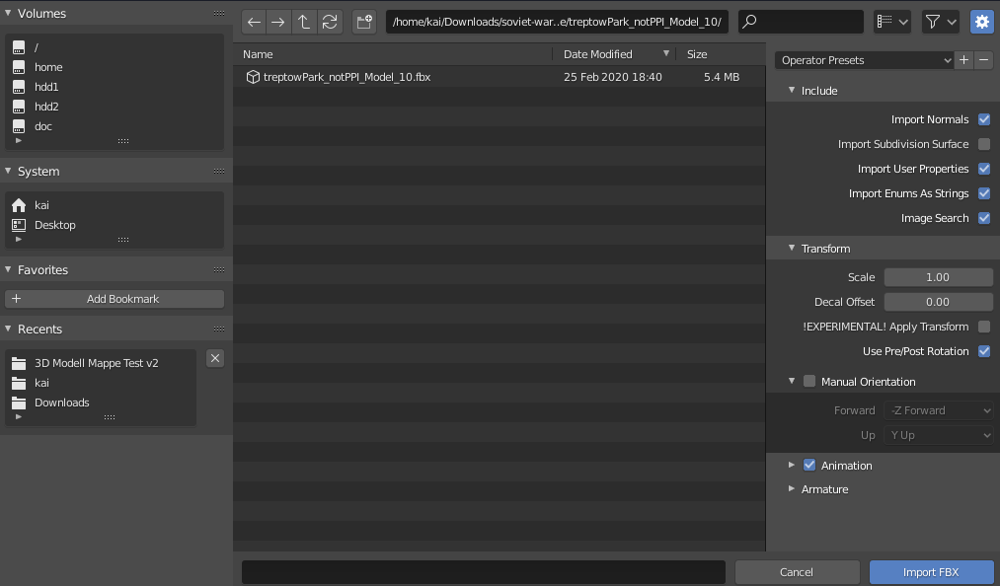

# Blender Export Guide for Kompakkt

## How to prepare and export your 3d model as glTF binary using Blender 2.80+

https://www.blender.org/download/

1. Install and open Blender

2. Look at the scene overview in the top right corner. If it's empty skip to step 4

3. Remove all lights, cameras and objects in the current scene

4. Prior to importing your 3d model your scene should look like this

5. In the top left corner of the screen, click on "File" and select the "Import" menu, then choose the file format of your 3d model

6. In the file dialog, navigate to your 3d model and import it. This might take a while depending on the size of your 3d model

7. Once imported, your model should appear in the scene view

8. At the top of the screen, switch to "Shading" mode to check if your model has its materials applied and displayed correctly

9. Back in "Layout" mode, left click your object once. The outline color should change to a brighter orange. Now right click to open the "Object Context Menu". Select "Set Origin" and choose the option "Geometry to Origin"

10. Before finally exporting, check if your model is rotated correctly and adjust it (if necessary) using the "Move" tool and the "Rotate" tool

11. To export, click on "File" in the top left corner, but this time select "Export" and choose the "glTF 2.0 (.glb/.gltf)" option

12. Navigate to the location where you want to save your model. Make sure "glTF Binary (.glb)" is selected as file format (should be by default), then press the export button

13. During upload to Kompakkt, select the newly exported .glb model

